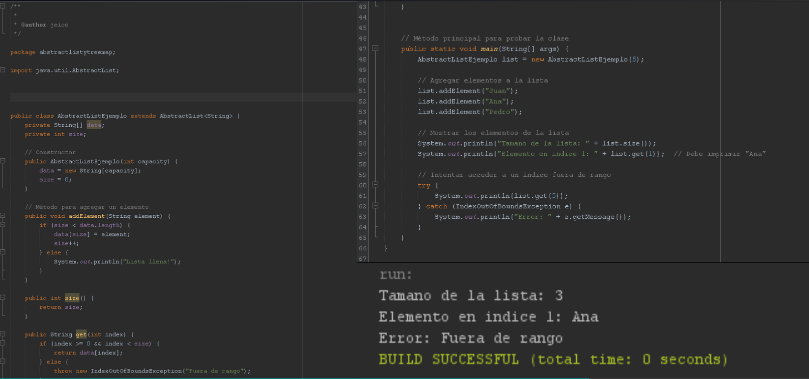
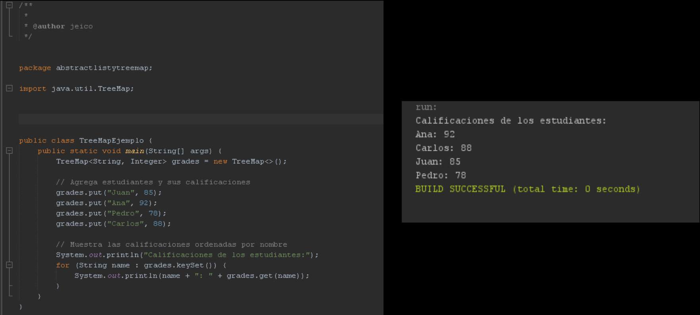
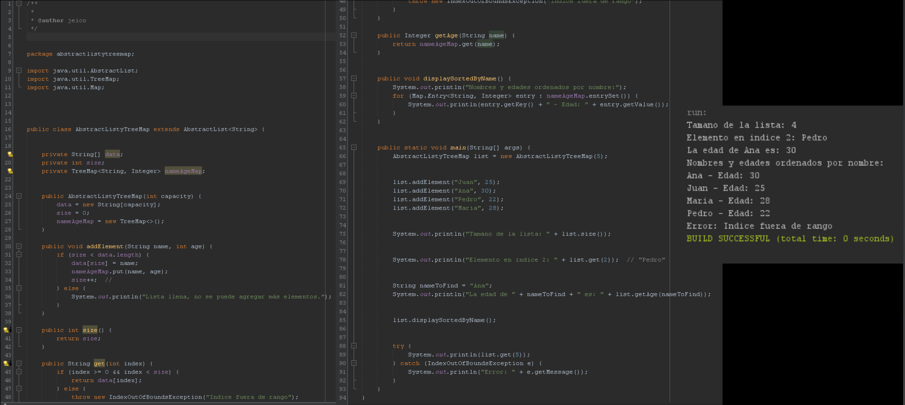

## AbstractListyTreeMap Jeicob Murillo

## Enlace al video de YouTube: https://youtu.be/r63azSgtFvU

## Enlace a la presentación: https://drive.google.com/file/d/1G51ErVdDvlJ8sTey3CUmMHT5BpY1Xzfa/view?usp=drive_link

## Ejemplo de AbstractList:

## Ejemplo de TreeMap:

## Ejemplo en conjunto de ambos:

